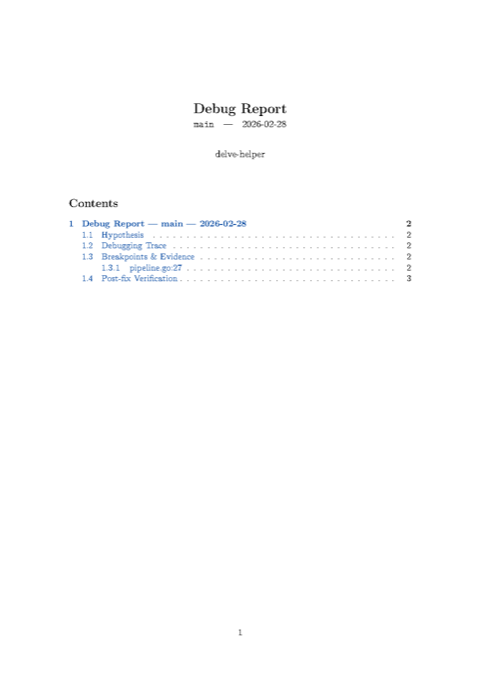
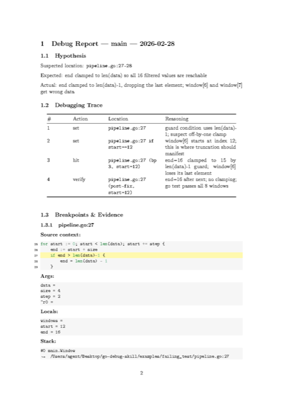
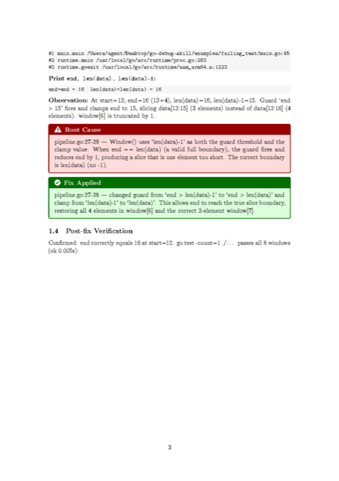

# go-debug-skill

An AI agent skill that interactively debugs Go programs using breakpoints, inspects runtime state via Delve, fixes bugs, and produces a PDF report.

**Example report** (failing test — off-by-one fix in `pipeline.go`). Click a page to open the [full PDF](examples/failing_test/debug_report_2026-02-28_10-05-16.pdf).

| Page 1 | Page 2 | Page 3 |
|--------|--------|--------|
| [](examples/failing_test/debug_report_2026-02-28_10-05-16.pdf) | [](examples/failing_test/debug_report_2026-02-28_10-05-16.pdf) | [](examples/failing_test/debug_report_2026-02-28_10-05-16.pdf) |

## Overview

`go-debug-skill` gives AI agents three integrated capabilities:

- **Interactive debugging with breakpoints** — the agent sets and clears breakpoints using a binary-search strategy, steps through execution, and collects runtime evidence (`args`, `locals`, `stack`, `print`) at each stop.
- **Bug fixing** — root cause is identified from collected evidence, a fix is applied, and Delve is re-run to verify. The loop repeats until all tests pass.
- **PDF report generation** — a structured Markdown report is built incrementally (hypothesis → trace table → evidence blocks → root-cause box → fix box) and compiled to PDF via Pandoc + pdflatex + Pygments. You can disable PDF by setting `DELVE_SKIP_PDF=1` or by asking (e.g. "no PDF", "debug without PDF"); the report then remains in the artifact dir as Markdown and LaTeX.

Multiple AI agents are supported via their native skill/rule mechanism. All agents follow the same 8-step debugging protocol and produce the same PDF report.

## Quick start

```bash
make install
```

Then open your Go project in Claude Code, Cursor, or Codex and ask: _"TestWindowLastFull is failing. Debug it."_

## What is Delve

[Delve](https://github.com/go-delve/delve) is the standard debugger for Go. It understands goroutines, Go's type system, and the Go runtime, and exposes a JSON-RPC API (`--headless --api-version=2`) that tools can drive programmatically. `go-debug-skill` uses this API through a small CLI wrapper (`delve-helper`) so AI agents can control the debugger without a human at the keyboard.

## Installation

```bash
make install
```

This installs:
- `dlv` (Delve CLI) to `~/.local/bin/dlv`
- `delve-helper` to `~/.local/bin/delve-helper`
- Agent skills/rules to their default directories
- LaTeX report templates to `~/.local/share/delve-debug/`

| Agent | Installed path | Trigger |
|-------|----------------|---------|
| **Claude Code** | `~/.claude/skills/delve.md` | `/delve` slash command, or ask to debug a Go program |
| **Cursor** | `~/.cursor/rules/delve-debug.mdc` | `/delve` in agent chat, or ask to debug a Go program |
| **Codex** | `~/.codex/skills/delve/SKILL.md` | invoke the `delve` skill explicitly, or describe a debug task |

Override destinations: `make install RULES_DIR=... SKILLS_DIR=... CODEX_SKILLS_DIR=...`

## Usage

### Debug a Go program with an AI agent

Once installed, point an AI agent at a Go project and trigger debugging:

- **Claude Code**: type `/delve` or "debug this Go program"
- **Cursor**: type `/delve` in the agent chat, or ask to debug `*.go`
- **Codex**: invoke the `delve` skill or describe the bug

The agent runs the full 8-step protocol automatically: it reads the code, forms a hypothesis, starts Delve, sets breakpoints, collects runtime evidence, identifies the root cause, applies a fix, and generates a PDF report.

### Use `delve-helper` directly (manual / scripting)

```bash
delve-helper start ./example          # start headless Delve for ./example
delve-helper start -test ./pkg        # debug tests
delve-helper start -exec ./binary     # debug an existing binary
delve-helper state                    # print current debugger state
delve-helper break main.Window        # set a breakpoint
delve-helper continue                 # resume execution
delve-helper locals                   # print local variables
delve-helper print expr               # evaluate an expression
delve-helper report-build ./debug_dir # convert .md → LaTeX → PDF
```

### Try the built-in examples

**Tests fail** (off-by-one in window slicing):
```bash
make reset-examples   # restore both examples/ to initial state (failing_test + crash)
make test-example     # confirm failing tests
make debug-example    # start headless Delve for ./example
```

**Crashes at runtime** (nil pointer dereference in signal processor):
```bash
make reset-example-crash   # restore only examples/crash/ to crashing state
make run-example-crash     # confirm the panic
make debug-example-crash   # start headless Delve for ./example_crash
```

Then invoke your AI agent and ask it to debug.

**Example reports** (PDFs produced by the 8-step protocol):

- [Off-by-one fix (failing test)](examples/failing_test/debug_report_2026-02-28_10-05-16.pdf) — window slice clamp corrected in `pipeline.go`
- [Nil pointer fix (crash)](examples/crash/debug_report_2026-02-28_10-04-45.pdf) — signal processor crash in `pipeline.go`

Each example directory may contain additional `debug_report_<date>_<time>.pdf` files from later runs.

### Run the end-to-end test

```bash
make test-e2e   # full cycle: reset → 3 Delve sessions → fix → PDF → assertions
```

### Protecting `examples/templates/`

`examples/templates/` holds pristine snapshots for `make reset-examples`; avoid editing them by mistake. Optional safeguards:

- **`make install-hooks`** — installs a git pre-commit hook that runs the template check (blocks commits touching `examples/templates/` unless `ALLOW_TEMPLATE_CHANGES=1`) and `go vet ./...` (lint).
- **`make check-templates`** — fails if there are uncommitted changes under `examples/templates/` (e.g. in CI or before release).

## How it works

### The 8-step debugging protocol

When a debug task is triggered, the agent follows this process:

| Step | Name | Description |
|------|------|-------------|
| **0** | Artifact dir | Creates `.debug_<date>/` and initialises `debug_report.md` |
| **1** | Hypothesis | Reads suspect code paths, states 1–3 hypotheses |
| **2** | Run Delve | Starts headless Delve; verifies session with `state` |
| **3** | Set breakpoints | Binary-search strategy; appends each action to trace table |
| **4** | Collect evidence | `continue` / `args` / `locals` / `stack` / `print`; appends verbatim blocks |
| **5** | Fix & verify | Applies fix, re-runs Delve; loops to Step 3 if not resolved |
| **6** | Generate PDF | `delve-helper report-build` → Pandoc → pdflatex |
| **7** | Remove artifact dir | `debug_report_<date>_<time>.pdf` at project root; `.debug_.../` removed |

Steps 3 → 4 → 5 form an iterative loop: if the fix is not verified at Step 5, the agent returns to Step 3 with an updated hypothesis and every iteration is documented incrementally. **Code review alone is insufficient** — the agent must execute Steps 2–5 with real runtime output before concluding.

### Architecture

```
delve-helper (CLI)
  ├── start          → spawns dlv --headless --api-version=2 (detached, survives helper exit)
  │                    writes address to .dlv/addr
  ├── break/continue/
  │   locals/...    → JSON-RPC calls to Delve API v2
  └── report-build  → MDToTex() (pandoc + minted.lua) → TexToPDF() (pdflatex -shell-escape)

Agent skills/rules
  ├── .claude/skills/delve.md       (Claude Code)
  ├── .cursor/rules/delve-debug.mdc (Cursor)
  └── .codex/skills/delve/SKILL.md  (Codex)
  All three encode the same 8-step protocol.

Source layout
  ├── cmd/delve-helper/              Minimal CLI entry point
  ├── internal/delvehelper/          All logic: client, commands, start, report, convert, templates
  ├── examples/
  │   ├── failing_test/              Sensor pipeline — tests fail (off-by-one in Window)
  │   ├── crash/                     Signal processor — crashes at runtime (nil pointer dereference)
  │   └── templates/                 **Do not edit** — pristine snapshots for `make reset-examples`. Use `make install-hooks` to block accidental commits; `make check-templates` to verify.
  │       ├── failing_test/
  │       └── crash/
  └── e2e/                           End-to-end test (reset → 3 Delve sessions → fix → PDF → assertions)
```

**PDF pipeline:** Markdown fragments → concatenated by `MDToTex()` → Pandoc (with `minted.lua` Lua filter) → LaTeX → `pdflatex -shell-escape` (Pygments for syntax highlighting) → PDF

## Requirements

- Go 1.21+
- Delve — installed automatically by `make install`
- Pandoc — for report generation (`brew install pandoc` / `apt install pandoc`)
- pdflatex with `minted` package (TeX Live / MacTeX)
- Pygments — `pip install pygments`

On macOS, the Delve server (or the system debugger it uses) may prompt for elevated permission the first time you start a debug session; this is expected. Grant the prompt so Delve can attach to processes. For details, see [Delve’s official documentation](https://github.com/go-delve/delve/tree/master/Documentation).
